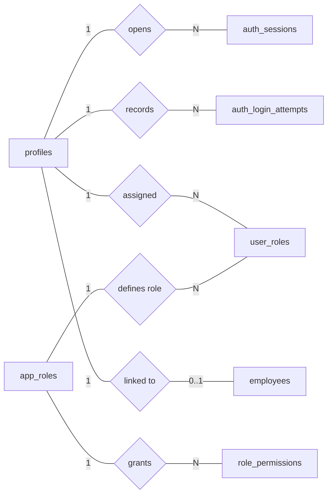
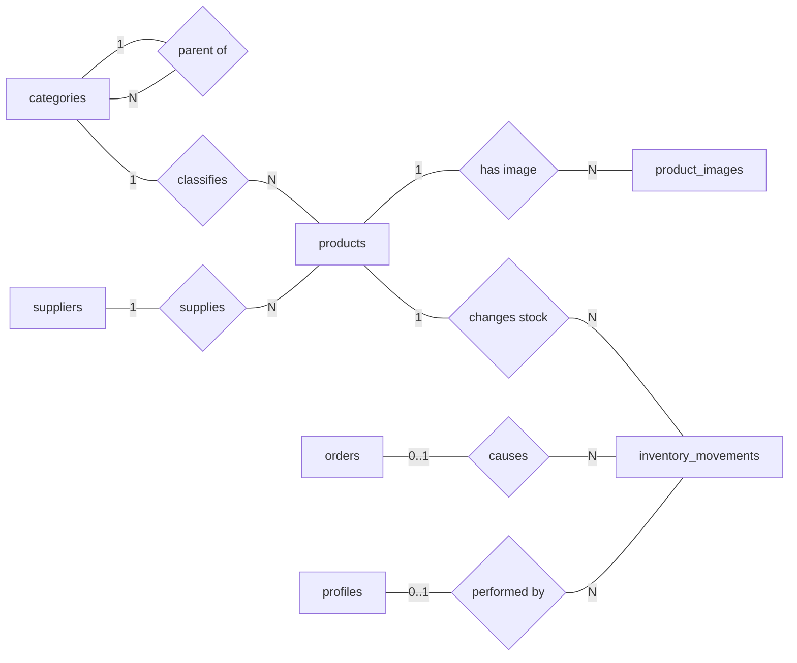
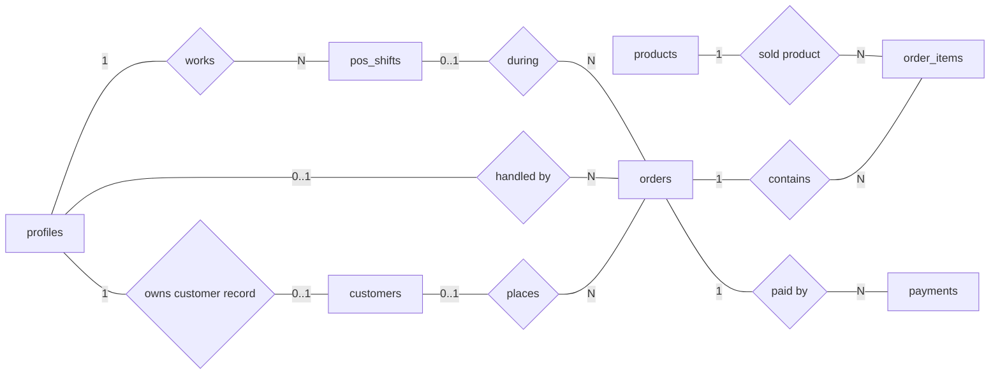
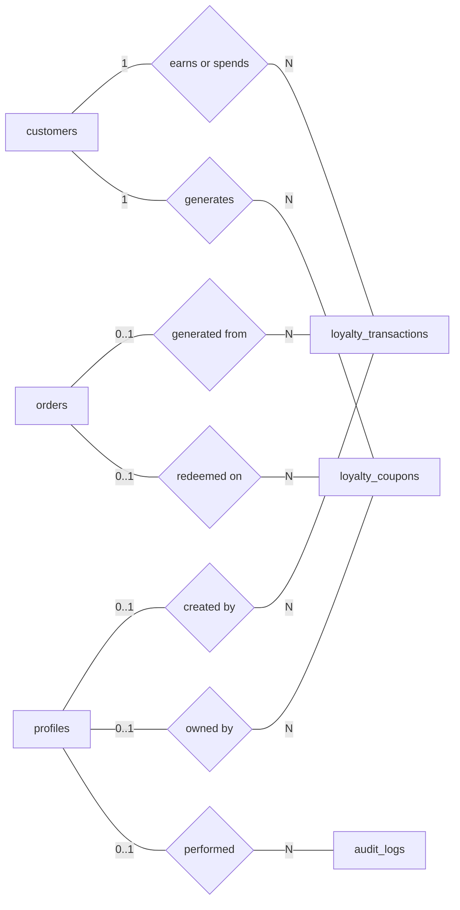
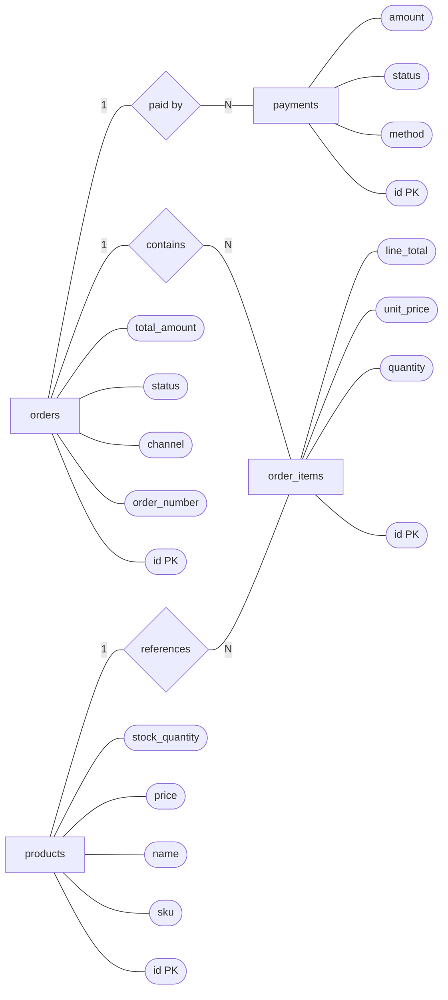

# PostgreSQL Database Tables, Relationships, and Chen-Style ERD

This chapter focuses on the backend database design for the Coffee Shop POS Commerce system. It matches the local PostgreSQL database shown in pgAdmin.

The PostgreSQL database has **20 tables**.

Earlier documentation counted 24 tables because it mixed the local PostgreSQL schema with extra Supabase-only ecommerce tables. For this assignment, the correct count is 20 because these are the tables that exist in the PostgreSQL database.

The 4 Supabase-only tables not included in this PostgreSQL ERD are:

- `addresses`
- `coupons`
- `carts`
- `cart_items`

## Source SQL Files

This ERD is based on the PostgreSQL SQL files:

- `postgres/pgadmin/001_plain_postgres.sql`
- `postgres/pgadmin/002_role_permissions.sql`
- `postgres/pgadmin/003_loyalty_transactions.sql`
- `postgres/pgadmin/004_loyalty_coupons.sql`
- `postgres/pgadmin/006_employee_staff_role_sync.sql`
- `postgres/pgadmin/007_custom_roles.sql`
- `postgres/pgadmin/008_custom_role_deactivation.sql`

## Chen ERD Notation

| Symbol | Meaning | Example |
| --- | --- | --- |
| Rectangle | Entity or database table | `products` |
| Diamond | Relationship between entities | `contains` |
| Oval | Attribute or column | `sku` |
| Key attribute | Primary key | `id` |
| `1` | One record | One order |
| `N` | Many records | Many order items |
| `0..1` | Optional single record | Optional customer profile |

In the database, relationships are implemented with foreign keys. In Chen notation, the same relationship is shown like this:

```text
Entity A -- cardinality -- Relationship -- cardinality -- Entity B
```

Example:

```text
orders -- 1 -- contains -- N -- order_items
```

This means one order can contain many order items, and each order item belongs to one order.

## Table Overview

| No. | Table | Primary Key | Important Foreign Keys | Purpose |
| --- | --- | --- | --- | --- |
| 1 | `profiles` | `id` | None | Stores application user accounts, including email, password hash, name, phone, and avatar path. |
| 2 | `auth_sessions` | `id` | `profile_id -> profiles.id` | Stores login sessions for authenticated users. |
| 3 | `auth_login_attempts` | `id` | `profile_id -> profiles.id` | Records successful and failed login attempts for security tracking. |
| 4 | `user_roles` | `id` | `profile_id -> profiles.id` | Assigns roles such as admin, manager, clerk, cashier, and customer to user profiles. |
| 5 | `app_roles` | `role` | Logical link to `user_roles.role` and `role_permissions.role` | Stores role metadata such as label, description, system role flag, and active status. |
| 6 | `role_permissions` | `(role, permission)` | Logical link to `app_roles.role` | Stores permissions granted to each role. |
| 7 | `employees` | `id` | `profile_id -> profiles.id` | Stores staff records, job roles, status, pay settings, schedules, and contact details. |
| 8 | `categories` | `id` | `parent_id -> categories.id` | Stores product categories and optional parent-child category hierarchy. |
| 9 | `suppliers` | `id` | None | Stores supplier contact information for stocked products. |
| 10 | `products` | `id` | `category_id -> categories.id`, `supplier_id -> suppliers.id` | Stores sellable products, SKU, barcode, price, cost, and stock quantity. |
| 11 | `product_images` | `id` | `product_id -> products.id` | Stores product image metadata. |
| 12 | `customers` | `id` | `profile_id -> profiles.id` | Stores customer records for registered and walk-in POS customers. |
| 13 | `pos_shifts` | `id` | `cashier_profile_id -> profiles.id`, `opened_by_profile_id -> profiles.id`, `closed_by_profile_id -> profiles.id` | Stores cashier shift opening and closing information for POS cash reconciliation. |
| 14 | `orders` | `id` | `customer_id -> customers.id`, `profile_id -> profiles.id`, `cashier_profile_id -> profiles.id`, `pos_shift_id -> pos_shifts.id` | Stores the sales header for POS and ecommerce orders. |
| 15 | `order_items` | `id` | `order_id -> orders.id`, `product_id -> products.id` | Stores product lines inside each order. |
| 16 | `payments` | `id` | `order_id -> orders.id` | Stores payment method, status, amount, and reference number for orders. |
| 17 | `loyalty_transactions` | `id` | `customer_id -> customers.id`, `order_id -> orders.id`, `created_by_profile_id -> profiles.id` | Stores the loyalty point ledger for earning, redeeming, adjusting, and reversing points. |
| 18 | `inventory_movements` | `id` | `product_id -> products.id`, `order_id -> orders.id`, `actor_profile_id -> profiles.id` | Stores stock movement history such as sales, restocks, returns, and adjustments. |
| 19 | `loyalty_coupons` | `id` | `customer_id -> customers.id`, `profile_id -> profiles.id`, `redeemed_order_id -> orders.id` | Stores discount coupons generated by redeeming loyalty points. |
| 20 | `audit_logs` | `id` | `actor_profile_id -> profiles.id` | Stores important backend activity logs for admin review and debugging. |

## Column Quick Reference

`PK` means primary key and `FK` means foreign key.

| Table | Important Columns |
| --- | --- |
| `profiles` | `id` PK, `email`, `password_hash`, `full_name`, `phone`, `avatar_path`, `created_at`, `updated_at` |
| `auth_sessions` | `id` PK, `profile_id` FK, `token_hash`, `expires_at`, `revoked_at`, `created_at` |
| `auth_login_attempts` | `id` PK, `email_hash`, `profile_id` FK, `ip_hash`, `user_agent_hash`, `success`, `failure_reason`, `attempted_at` |
| `user_roles` | `id` PK, `profile_id` FK, `role`, `created_at`, `updated_at` |
| `app_roles` | `role` PK, `label`, `description`, `kind`, `is_system`, `is_active`, `created_at`, `updated_at` |
| `role_permissions` | `role` PK, `permission` PK, `created_at` |
| `employees` | `id` PK, `profile_id` FK, `full_name`, `email`, `phone`, `role`, `status`, `pay_type`, `salary_amount`, `hourly_rate`, `work_days`, `shift_start`, `shift_end`, `start_date`, `emergency_contact`, `address`, `notes`, `created_at`, `updated_at` |
| `categories` | `id` PK, `parent_id` FK, `name`, `slug`, `description`, `is_active`, `created_at`, `updated_at` |
| `suppliers` | `id` PK, `name`, `contact_name`, `email`, `phone`, `notes`, `is_active`, `created_at`, `updated_at` |
| `products` | `id` PK, `category_id` FK, `supplier_id` FK, `name`, `slug`, `description`, `sku`, `barcode`, `price`, `cost`, `stock_quantity`, `low_stock_threshold`, `is_active`, `deleted_at`, `created_at`, `updated_at` |
| `product_images` | `id` PK, `product_id` FK, `storage_path`, `public_url`, `alt_text`, `sort_order`, `is_primary`, `created_at`, `updated_at` |
| `customers` | `id` PK, `profile_id` FK, `full_name`, `email`, `phone`, `notes`, `loyalty_points`, `is_active`, `created_at`, `updated_at` |
| `pos_shifts` | `id` PK, `cashier_profile_id` FK, `opened_by_profile_id` FK, `closed_by_profile_id` FK, `cashier_name`, `status`, `opening_cash`, `closing_cash`, `expected_cash`, `cash_difference`, `cash_sales_amount`, `card_sales_amount`, `qr_sales_amount`, `total_sales_amount`, `order_count`, `opened_at`, `closed_at`, `notes`, `created_at`, `updated_at` |
| `orders` | `id` PK, `order_number`, `customer_id` FK, `profile_id` FK, `cashier_profile_id` FK, `pos_shift_id` FK, `channel`, `status`, `payment_status`, `subtotal_amount`, `discount_amount`, `tax_amount`, `shipping_amount`, `total_amount`, `notes`, `created_at`, `updated_at` |
| `order_items` | `id` PK, `order_id` FK, `product_id` FK, `product_name`, `sku`, `quantity`, `unit_price`, `discount_amount`, `line_total`, `created_at`, `updated_at` |
| `payments` | `id` PK, `order_id` FK, `method`, `status`, `amount`, `reference_number`, `paid_at`, `metadata`, `created_at`, `updated_at` |
| `loyalty_transactions` | `id` PK, `customer_id` FK, `order_id` FK, `created_by_profile_id` FK, `transaction_type`, `points_delta`, `balance_after`, `description`, `created_at`, `updated_at` |
| `inventory_movements` | `id` PK, `product_id` FK, `order_id` FK, `actor_profile_id` FK, `quantity_delta`, `movement_type`, `reason`, `created_at`, `updated_at` |
| `loyalty_coupons` | `id` PK, `code`, `customer_id` FK, `profile_id` FK, `discount_percent`, `points_spent`, `status`, `expires_at`, `redeemed_order_id` FK, `redeemed_at`, `created_at`, `updated_at` |
| `audit_logs` | `id` PK, `actor_profile_id` FK, `entity_type`, `entity_id`, `action`, `before_data`, `after_data`, `created_at`, `updated_at` |

## Main Table Details

### `profiles`

Stores login account data used by staff and customers.

| Column | Type | Key | Description |
| --- | --- | --- | --- |
| `id` | `uuid` | PK | User account identifier. |
| `email` | `citext` | Unique | User email address. |
| `password_hash` | `text` |  | Hashed password for local PostgreSQL authentication. |
| `full_name` | `text` |  | User full name. |
| `phone` | `text` |  | Optional phone number. |
| `avatar_path` | `text` |  | Optional avatar image path. |

### `products`

Stores items that can be sold through POS or ecommerce.

| Column | Type | Key | Description |
| --- | --- | --- | --- |
| `id` | `uuid` | PK | Product identifier. |
| `category_id` | `uuid` | FK | References `categories.id`. |
| `supplier_id` | `uuid` | FK | References `suppliers.id`. |
| `name` | `text` |  | Product name. |
| `slug` | `text` | Unique | URL-friendly product name. |
| `sku` | `text` | Unique | Stock keeping unit. |
| `barcode` | `text` | Unique | Optional barcode for scanning. |
| `price` | `numeric(12,2)` |  | Selling price. |
| `cost` | `numeric(12,2)` |  | Product cost. |
| `stock_quantity` | `integer` |  | Current stock quantity. |
| `low_stock_threshold` | `integer` |  | Quantity level used for low-stock alerts. |
| `is_active` | `boolean` |  | Whether the product is active. |

### `orders`

Stores the main sale transaction.

| Column | Type | Key | Description |
| --- | --- | --- | --- |
| `id` | `uuid` | PK | Order identifier. |
| `order_number` | `text` | Unique | Human-readable order number. |
| `customer_id` | `uuid` | FK | References `customers.id`. |
| `profile_id` | `uuid` | FK | References `profiles.id` for registered customers. |
| `cashier_profile_id` | `uuid` | FK | References `profiles.id` for cashier sales. |
| `pos_shift_id` | `uuid` | FK | References `pos_shifts.id`. |
| `channel` | `sale_channel` |  | `pos` or `ecommerce`. |
| `status` | `order_status` |  | Order status such as completed, cancelled, or refunded. |
| `payment_status` | `payment_status` |  | Payment state such as paid or unpaid. |
| `subtotal_amount` | `numeric(12,2)` |  | Total before discount, tax, and shipping. |
| `discount_amount` | `numeric(12,2)` |  | Discount amount. |
| `tax_amount` | `numeric(12,2)` |  | Tax amount. |
| `shipping_amount` | `numeric(12,2)` |  | Shipping amount. |
| `total_amount` | `numeric(12,2)` |  | Final payable amount. |

### `order_items`

Stores the product lines inside an order.

| Column | Type | Key | Description |
| --- | --- | --- | --- |
| `id` | `uuid` | PK | Order item identifier. |
| `order_id` | `uuid` | FK | References `orders.id`. |
| `product_id` | `uuid` | FK | References `products.id`. |
| `product_name` | `text` |  | Product name copied at sale time. |
| `sku` | `text` |  | Product SKU copied at sale time. |
| `quantity` | `integer` |  | Quantity sold. |
| `unit_price` | `numeric(12,2)` |  | Selling price copied at sale time. |
| `discount_amount` | `numeric(12,2)` |  | Item-level discount. |
| `line_total` | `numeric(12,2)` |  | Final total for the line item. |

### `inventory_movements`

Stores stock changes as a ledger.

| Column | Type | Key | Description |
| --- | --- | --- | --- |
| `id` | `uuid` | PK | Inventory movement identifier. |
| `product_id` | `uuid` | FK | Product whose stock changed. |
| `order_id` | `uuid` | FK | Related order, if the movement came from a sale or return. |
| `actor_profile_id` | `uuid` | FK | User who performed the stock action. |
| `quantity_delta` | `integer` |  | Positive or negative stock change. |
| `movement_type` | `inventory_movement_type` |  | Sale, restock, adjustment, return, or initial stock. |
| `reason` | `text` |  | Reason for the movement. |

## Relationship List

| Relationship | Cardinality | Foreign Key | Meaning |
| --- | --- | --- | --- |
| `profiles` has `auth_sessions` | `1:N` | `auth_sessions.profile_id` | One profile can have many login sessions. |
| `profiles` has `auth_login_attempts` | `1:N` | `auth_login_attempts.profile_id` | One profile can have many login attempt records. |
| `profiles` has `user_roles` | `1:N` | `user_roles.profile_id` | One user can have multiple role assignments. |
| `app_roles` defines `user_roles` | `1:N` logical | `user_roles.role` | Role assignments use role values defined in app role metadata. |
| `app_roles` defines `role_permissions` | `1:N` logical | `role_permissions.role` | One role can have many permissions. |
| `profiles` has `employees` | `1:0..1` | `employees.profile_id` | One profile can be linked to one employee record. |
| `categories` has child `categories` | `1:N` | `categories.parent_id` | One category can have many subcategories. |
| `categories` has `products` | `1:N` | `products.category_id` | One category can contain many products. |
| `suppliers` supplies `products` | `1:N` | `products.supplier_id` | One supplier can provide many products. |
| `products` has `product_images` | `1:N` | `product_images.product_id` | One product can have many images. |
| `profiles` has `customers` | `1:0..1` | `customers.profile_id` | One registered user can have one customer record. |
| `profiles` opens `pos_shifts` | `1:N` | `pos_shifts.opened_by_profile_id` | One staff profile can open many POS shifts. |
| `profiles` closes `pos_shifts` | `1:N` | `pos_shifts.closed_by_profile_id` | One staff profile can close many POS shifts. |
| `profiles` works `pos_shifts` | `1:N` | `pos_shifts.cashier_profile_id` | One cashier profile can work many shifts. |
| `customers` places `orders` | `1:N` | `orders.customer_id` | One customer can place many orders. |
| `profiles` places `orders` | `1:N` | `orders.profile_id` | One registered profile can place many ecommerce orders. |
| `profiles` handles `orders` | `1:N` | `orders.cashier_profile_id` | One cashier can handle many POS orders. |
| `pos_shifts` contains `orders` | `1:N` | `orders.pos_shift_id` | One POS shift can contain many orders. |
| `orders` contains `order_items` | `1:N` | `order_items.order_id` | One order contains many product lines. |
| `products` appears in `order_items` | `1:N` | `order_items.product_id` | One product can be sold in many order items. |
| `orders` has `payments` | `1:N` | `payments.order_id` | One order can have one or more payment records. |
| `customers` has `loyalty_transactions` | `1:N` | `loyalty_transactions.customer_id` | One customer can have many point ledger records. |
| `orders` creates `loyalty_transactions` | `1:N` | `loyalty_transactions.order_id` | One paid order can create loyalty point records. |
| `profiles` creates `loyalty_transactions` | `1:N` | `loyalty_transactions.created_by_profile_id` | One user can create many loyalty changes. |
| `products` has `inventory_movements` | `1:N` | `inventory_movements.product_id` | One product can have many stock movement records. |
| `orders` creates `inventory_movements` | `1:N` | `inventory_movements.order_id` | One order can create stock movement records. |
| `profiles` performs `inventory_movements` | `1:N` | `inventory_movements.actor_profile_id` | One user can perform many stock actions. |
| `customers` has `loyalty_coupons` | `1:N` | `loyalty_coupons.customer_id` | One customer can generate many loyalty coupons. |
| `profiles` owns `loyalty_coupons` | `1:N` | `loyalty_coupons.profile_id` | One profile can own many loyalty coupons. |
| `orders` redeems `loyalty_coupons` | `1:N` | `loyalty_coupons.redeemed_order_id` | One order can be linked to redeemed loyalty coupons. |
| `profiles` creates `audit_logs` | `1:N` | `audit_logs.actor_profile_id` | One user can create many audit log records. |

## Chen-Style ERD: Identity and Access



## Chen-Style ERD: Catalog and Inventory



## Chen-Style ERD: POS Sales and Payment



## Chen-Style ERD: Loyalty and Audit



## Chen-Style Attribute Example

This smaller example shows Chen-style attributes for the most important sales entities.



## Important Backend Design Notes

1. `orders` and `order_items` are separated because one order can contain many products.
2. `order_items` stores `product_name`, `sku`, `unit_price`, and `line_total` as sale-time snapshots, so old receipts remain correct even if product data changes later.
3. `products.stock_quantity` stores the current stock quantity, while `inventory_movements` stores the history of why stock changed.
4. `customers` is separate from `profiles` because POS can serve walk-in customers without login accounts.
5. `profiles`, `user_roles`, `app_roles`, and `role_permissions` support backend authentication and authorization.
6. `pos_shifts` connects POS sales to cashier shift reconciliation.
7. `loyalty_transactions` works like a point ledger, which is safer than only storing the current point balance in `customers`.
8. `loyalty_coupons` stores coupons generated from loyalty point redemption.
9. `audit_logs` stores important actions so admins can review backend changes.

## Normalization Summary

| Normal Form | How This Database Applies It |
| --- | --- |
| First Normal Form | Each table stores atomic values, such as one product per `products` row and one payment per `payments` row. |
| Second Normal Form | Line tables such as `order_items` store facts that depend on the whole row identifier. |
| Third Normal Form | Repeated concepts are separated into their own tables, such as `categories`, `suppliers`, `customers`, `payments`, and `employees`. |

## Most Important Relationships for the Assignment

If the report needs a shorter ERD section, focus on these core relationships:

| Entity A | Relationship | Entity B | Cardinality |
| --- | --- | --- | --- |
| `categories` | classifies | `products` | `1:N` |
| `suppliers` | supplies | `products` | `1:N` |
| `customers` | places | `orders` | `1:N` |
| `pos_shifts` | contains | `orders` | `1:N` |
| `orders` | contains | `order_items` | `1:N` |
| `products` | appears in | `order_items` | `1:N` |
| `orders` | has | `payments` | `1:N` |
| `products` | has | `inventory_movements` | `1:N` |
| `profiles` | assigned | `user_roles` | `1:N` |
| `customers` | has | `loyalty_transactions` | `1:N` |
