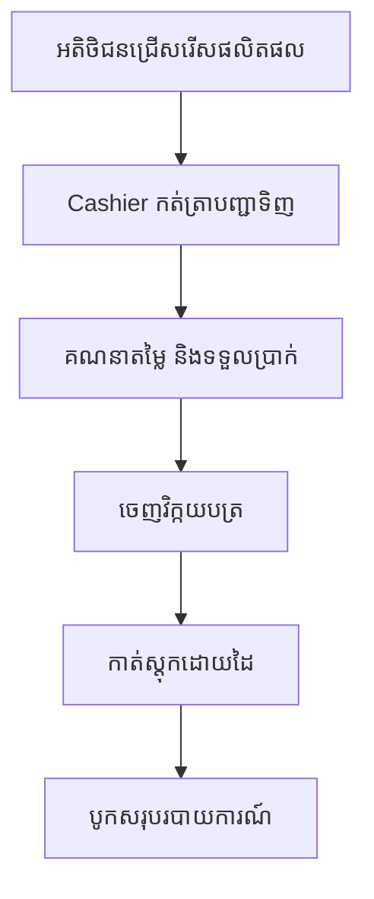
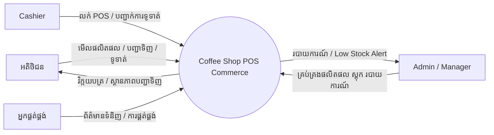
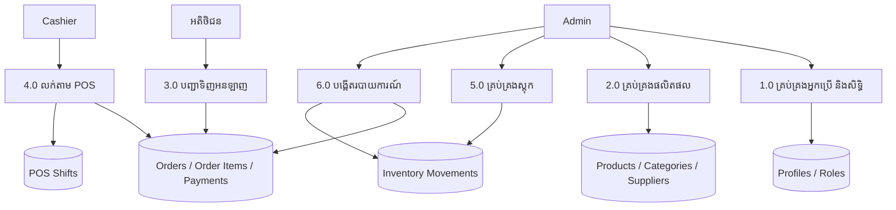
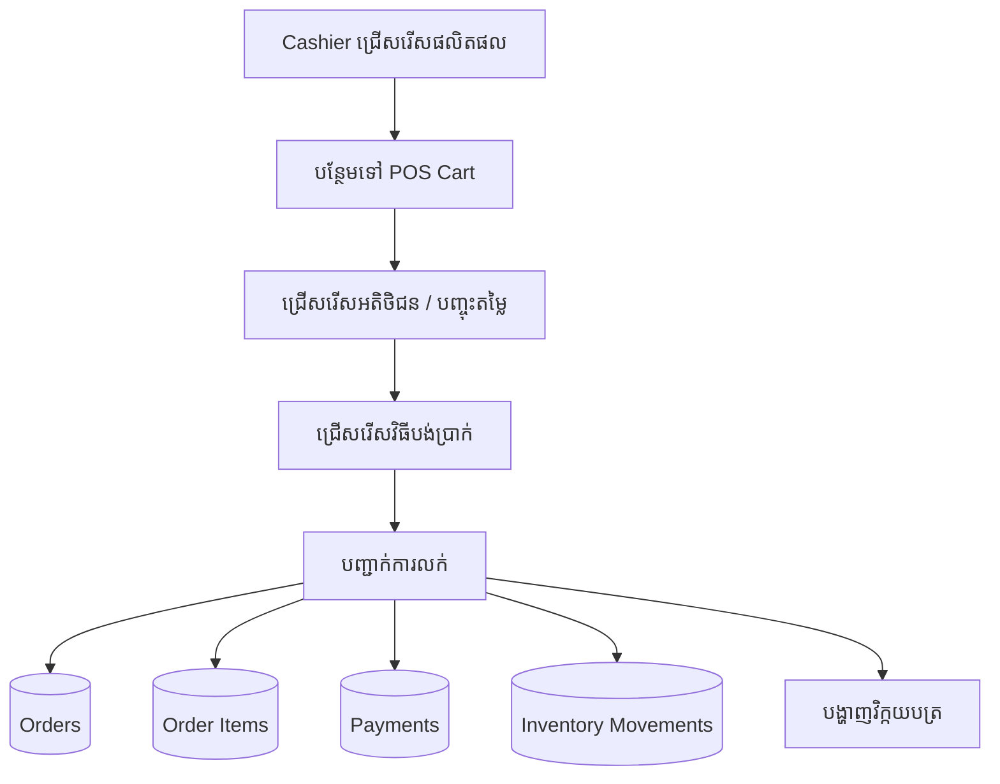
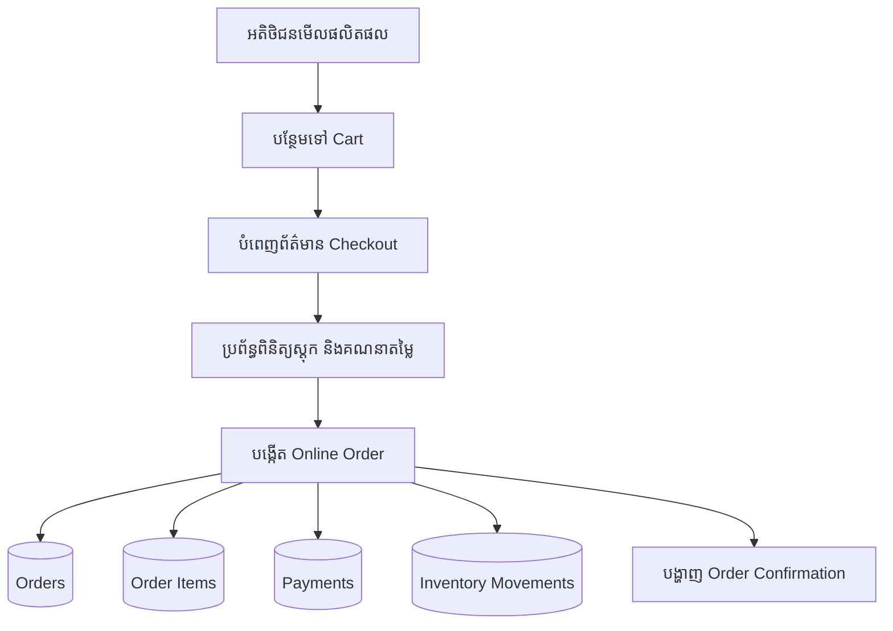
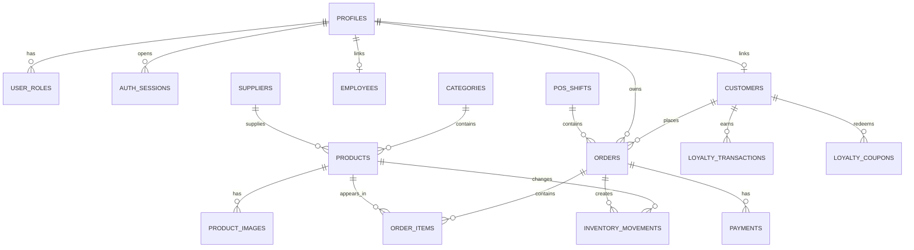
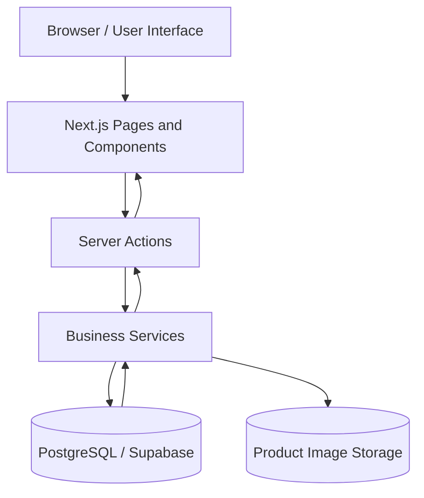

# ជំពូកទី ៣
# វិធីសាស្រ្ត និងរចនាសម្ព័ន្ធនៃការសិក្សា

> កំណត់សម្គាល់៖ គម្រោងនេះផ្អែកលើប្រព័ន្ធ **Coffee Shop POS Commerce** ដែលជាប្រព័ន្ធគ្រប់គ្រងការលក់ POS និងអ៊ី-ខូមឺសសម្រាប់ហាងកាហ្វេ។ ដូច្នេះពាក្យដែលមានន័យទៅរក “គ្លីនិក” ក្នុងគំរូដើម ត្រូវបានកែសម្រួលឱ្យសមស្របជាមួយ “ហាងកាហ្វេ / ប្រព័ន្ធលក់ / ប្រព័ន្ធគ្រប់គ្រងផលិតផល និងស្តុក”។

## ៣.១. វិធីសាស្រ្តនៃការសិក្សា

ការសិក្សានេះត្រូវបានរៀបចំឡើងក្នុងលក្ខណៈជាការស្រាវជ្រាវអនុវត្តន៍ ដោយផ្តោតលើការវិភាគបញ្ហាពិត ការគ្រោងប្រព័ន្ធថ្មី និងការអនុវត្តប្រព័ន្ធគ្រប់គ្រងការលក់សម្រាប់ហាងកាហ្វេ។ គោលបំណងសំខាន់គឺបង្កើតប្រព័ន្ធមួយដែលអាចជួយឱ្យការលក់តាម POS ការបញ្ជាទិញតាមគេហទំព័រ ការគ្រប់គ្រងផលិតផល ស្តុក អតិថិជន បុគ្គលិក និងរបាយការណ៍ មានភាពរហ័ស ត្រឹមត្រូវ និងងាយស្រួលត្រួតពិនិត្យ។

វិធីសាស្រ្តដែលបានប្រើក្នុងការសិក្សាមានដូចខាងក្រោម៖

### ក. ការសិក្សាឯកសារ

អ្នកសិក្សាបានពិនិត្យឯកសារដែលពាក់ព័ន្ធនឹងប្រព័ន្ធ POS និងអ៊ី-ខូមឺស ដូចជា របៀបគ្រប់គ្រងផលិតផល របៀបបង្កើតវិក្កយបត្រ របៀបកាត់ស្តុក របៀបគ្រប់គ្រងតួនាទីអ្នកប្រើ និងរបៀបបង្កើតរបាយការណ៍លក់។ ការសិក្សាឯកសារនេះជួយឱ្យយល់ពីតម្រូវការមុខងារ និងទិន្នន័យដែលត្រូវមាននៅក្នុងប្រព័ន្ធ។

### ខ. ការសង្កេតដំណើរការការងារ

ការសង្កេតត្រូវបានធ្វើលើដំណើរការលក់ទូទៅរបស់ហាងកាហ្វេ ដូចជា ការទទួលបញ្ជាទិញពីអតិថិជន ការជ្រើសរើសផលិតផល ការគណនាតម្លៃ ការទទួលប្រាក់ ការចេញវិក្កយបត្រ និងការកែប្រែចំនួនស្តុក។ លទ្ធផលនៃការសង្កេតបង្ហាញថា ប្រសិនបើដំណើរការទាំងនេះធ្វើដោយដៃ ឬប្រើឯកសារផ្សេងៗគ្នាច្រើន នឹងធ្វើឱ្យមានការយឺតយ៉ាវ និងកំហុសក្នុងទិន្នន័យ។

### គ. ការវិភាគតម្រូវការ

តម្រូវការប្រព័ន្ធត្រូវបានបែងចែកជាពីរផ្នែកគឺ តម្រូវការមុខងារ និងតម្រូវការមិនមែនមុខងារ។ តម្រូវការមុខងាររួមមាន ការចូលប្រើប្រាស់ប្រព័ន្ធ ការគ្រប់គ្រងផលិតផល ការគ្រប់គ្រងប្រភេទផលិតផល ការគ្រប់គ្រងអ្នកផ្គត់ផ្គង់ ការបញ្ជាទិញតាមគេហទំព័រ ការលក់តាម POS ការគ្រប់គ្រងស្តុក ការគ្រប់គ្រងអតិថិជន ការគ្រប់គ្រងបុគ្គលិក ការបង្កើតរបាយការណ៍ និងការគ្រប់គ្រងសិទ្ធិអ្នកប្រើ។ តម្រូវការមិនមែនមុខងាររួមមាន សុវត្ថិភាព ទិន្នន័យត្រឹមត្រូវ ភាពងាយស្រួលប្រើប្រាស់ ល្បឿនប្រតិបត្តិការ និងភាពអាចពង្រីកបាន។

### ឃ. វិធីសាស្រ្តអភិវឌ្ឍប្រព័ន្ធ

ក្នុងការអភិវឌ្ឍប្រព័ន្ធនេះ បានប្រើគំនិតរបស់ SDLC ដោយមានជំហានសំខាន់ៗដូចជា៖

1. ការសិក្សាបញ្ហា និងប្រមូលតម្រូវការ
2. ការវិភាគប្រព័ន្ធបច្ចុប្បន្ន
3. ការគ្រោងប្រព័ន្ធសំណើ
4. ការគ្រោងមូលដ្ឋានទិន្នន័យ និងរចនាសម្ព័ន្ធកម្មវិធី
5. ការសរសេរកូដ
6. ការសាកល្បង
7. ការដំឡើង និងការអនុវត្តប្រព័ន្ធ

វិធីសាស្រ្តនេះសមស្របសម្រាប់គម្រោងសិស្ស/និស្សិត ព្រោះវាមានលំដាប់ច្បាស់ ងាយតាមដាន និងអាចបង្ហាញការងារចាប់ពីការវិភាគរហូតដល់ការអនុវត្តបានពេញលេញ។

### ង. ឧបករណ៍ និងបច្ចេកវិទ្យាដែលបានប្រើ

ប្រព័ន្ធនេះត្រូវបានអភិវឌ្ឍដោយប្រើបច្ចេកវិទ្យាសំខាន់ៗដូចខាងក្រោម៖

| ឧបករណ៍ / បច្ចេកវិទ្យា | ការប្រើប្រាស់ |
| --- | --- |
| Visual Studio Code | សរសេរ និងគ្រប់គ្រងកូដកម្មវិធី |
| Next.js App Router | បង្កើតគេហទំព័រ និង Server Actions |
| TypeScript | កាត់បន្ថយកំហុសក្នុងកូដ និងកំណត់ប្រភេទទិន្នន័យ |
| Tailwind CSS | រចនារូបរាង និងផ្ទាំងប្រើប្រាស់ |
| PostgreSQL | រក្សាទុកទិន្នន័យប្រព័ន្ធ |
| Supabase | ជម្រើសសម្រាប់ Auth, Database, Storage និង Realtime |
| pgAdmin | គ្រប់គ្រង និងពិនិត្យមូលដ្ឋានទិន្នន័យ PostgreSQL |
| Git | គ្រប់គ្រងប្រវត្តិកែប្រែកូដ |
| Node.js និង npm | ដំណើរការបរិស្ថានអភិវឌ្ឍកម្មវិធី |

### ច. វិធីសាស្រ្តសាកល្បង

ការសាកល្បងប្រព័ន្ធត្រូវបានធ្វើទាំងផ្នែកបច្ចេកទេស និងផ្នែកមុខងារ។ ផ្នែកបច្ចេកទេសប្រើ `npm run typecheck` ដើម្បីពិនិត្យ TypeScript និង `npm run lint` ដើម្បីពិនិត្យស្តង់ដារកូដ។ ផ្នែកមុខងារត្រូវបានសាកល្បងដោយដំណើរការករណីប្រើប្រាស់សំខាន់ៗ ដូចជា ចូលប្រព័ន្ធ បង្កើតផលិតផល លក់តាម POS បញ្ជាទិញតាមគេហទំព័រ កាត់ស្តុក បង្កើតអតិថិជន និងមើលរបាយការណ៍។

## ៣.២. រចនាសម្ព័ន្ធនៃការសិក្សា

ការសិក្សានេះត្រូវបានរៀបចំជារចនាសម្ព័ន្ធច្បាស់លាស់ ដើម្បីបង្ហាញពីដំណើរការស្រាវជ្រាវ និងការអភិវឌ្ឍប្រព័ន្ធតាមលំដាប់។ រចនាសម្ព័ន្ធសិក្សារួមមានការពិពណ៌នាបញ្ហា ការវិភាគប្រព័ន្ធបច្ចុប្បន្ន ការគ្រោងប្រព័ន្ធសំណើ ការរចនាមូលដ្ឋានទិន្នន័យ ការអនុវត្តកម្មវិធី និងការសាកល្បង។

ផ្នែកសំខាន់ៗនៃការសិក្សាមានដូចជា៖

| ផ្នែក | ព័ត៌មានសង្ខេប |
| --- | --- |
| ការសិក្សាបញ្ហា | សិក្សាបញ្ហានៃការគ្រប់គ្រងការលក់ ការបញ្ជាទិញ និងស្តុកដោយដៃ |
| ការវិភាគប្រព័ន្ធបច្ចុប្បន្ន | ពិនិត្យលំហូរការងារចាស់ និងកំណត់ចំណុចខ្សោយ |
| ការវិភាគប្រព័ន្ធសំណើ | បង្ហាញដំណើរការប្រព័ន្ធថ្មី និងតម្រូវការទិន្នន័យ |
| ការគ្រោងប្រព័ន្ធ | រចនា Input, Output, Menu Structure, Database និង Architecture |
| ការអនុវត្ត | សរសេរកូដ ដំឡើងមូលដ្ឋានទិន្នន័យ និងភ្ជាប់មុខងារ |
| ការសាកល្បង | ពិនិត្យមុខងារ សុវត្ថិភាព និងភាពត្រឹមត្រូវនៃទិន្នន័យ |

ក្នុងប្រព័ន្ធ Coffee Shop POS Commerce មានម៉ូឌុលសំខាន់ៗដូចខាងក្រោម៖

| ម៉ូឌុល | មុខងារ |
| --- | --- |
| Storefront | បង្ហាញផលិតផល ប្រភេទផលិតផល ព័ត៌មានផលិតផល និងការបញ្ជាទិញតាមគេហទំព័រ |
| Cart and Checkout | រក្សាទុកកន្ត្រកទំនិញ គណនាតម្លៃ ពន្ធ និងថ្លៃដឹកជញ្ជូន |
| Authentication | ចូលប្រព័ន្ធ ចុះឈ្មោះ និងកំណត់តួនាទីអ្នកប្រើ |
| POS | លក់នៅបញ្ជរ ជ្រើសរើសអតិថិជន បញ្ចុះតម្លៃ ទូទាត់ប្រាក់ និងបោះពុម្ពវិក្កយបត្រ |
| Product Management | បង្កើត កែប្រែ បិទ/បើកផលិតផល និងគ្រប់គ្រងរូបភាព |
| Inventory | ត្រួតពិនិត្យស្តុក កែតម្រូវស្តុក និងរក្សាទុកប្រវត្តិចលនាស្តុក |
| Customer CRM | គ្រប់គ្រងអតិថិជន ពិន្ទុសមាជិក និងប្រវត្តិការទិញ |
| Employee Management | គ្រប់គ្រងបុគ្គលិក តួនាទី ស្ថានភាពការងារ និងគណនាស្ថិតិលក់ |
| Reports | បង្ហាញចំណូល ការលក់តាមប្រភេទ បង់ប្រាក់តាមមធ្យោបាយ និងផលិតផលលក់ដាច់ |
| Role and Access | កំណត់សិទ្ធិចូលប្រើប្រាស់តាមតួនាទី |

## ៣.៣. គម្រោងពេលវេលាការសិក្សា

គម្រោងពេលវេលាត្រូវបានរៀបចំដើម្បីឱ្យការសិក្សា និងការអភិវឌ្ឍប្រព័ន្ធអាចដំណើរការបានមានរបៀប និងសម្រេចតាមគោលដៅ។ តារាងខាងក្រោមបង្ហាញពីផែនការសិក្សា និងអភិវឌ្ឍប្រព័ន្ធក្នុងរយៈពេល ១២ សប្តាហ៍។

| សប្តាហ៍ | សកម្មភាព |
| --- | --- |
| សប្តាហ៍ទី ១ | ជ្រើសរើសប្រធានបទ កំណត់គោលបំណង និងវិសាលភាពគម្រោង |
| សប្តាហ៍ទី ២ | ប្រមូលព័ត៌មាន និងសិក្សាឯកសារពាក់ព័ន្ធនឹងប្រព័ន្ធ POS និងអ៊ី-ខូមឺស |
| សប្តាហ៍ទី ៣ | វិភាគប្រព័ន្ធបច្ចុប្បន្ន កំណត់បញ្ហា និងតម្រូវការ |
| សប្តាហ៍ទី ៤ | រៀបចំ Context Diagram, Diagram 0 និង Child Diagram |
| សប្តាហ៍ទី ៥ | វិភាគទិន្នន័យ រៀបចំ ER-Diagram និង Data Dictionary |
| សប្តាហ៍ទី ៦ | រចនា Input Design, Output Design និង Menu Structure |
| សប្តាហ៍ទី ៧ | បង្កើតមូលដ្ឋានទិន្នន័យ និងតារាងសំខាន់ៗ |
| សប្តាហ៍ទី ៨ | សរសេរកូដផ្នែក Storefront, Login និង Customer Checkout |
| សប្តាហ៍ទី ៩ | សរសេរកូដផ្នែក Admin Dashboard, Product និង Inventory |
| សប្តាហ៍ទី ១០ | សរសេរកូដផ្នែក POS, Receipt, Payment និង Reports |
| សប្តាហ៍ទី ១១ | សាកល្បងប្រព័ន្ធ កែបញ្ហា និងពិនិត្យភាពត្រឹមត្រូវ |
| សប្តាហ៍ទី ១២ | រៀបចំរបាយការណ៍ចុងក្រោយ និងត្រៀមធ្វើបទបង្ហាញ |

# ជំពូកទី ៤
# ការវិភាគ ការគ្រោង និងការអនុវត្ត

## ៤.១. ការវិភាគប្រព័ន្ធ

ការវិភាគប្រព័ន្ធជាដំណាក់កាលសំខាន់ក្នុងការអភិវឌ្ឍកម្មវិធី ព្រោះវាជួយឱ្យយល់ច្បាស់អំពីបញ្ហានៃប្រព័ន្ធបច្ចុប្បន្ន និងតម្រូវការរបស់ប្រព័ន្ធថ្មី។ សម្រាប់គម្រោងនេះ ការវិភាគត្រូវបានផ្តោតលើប្រព័ន្ធគ្រប់គ្រងការលក់របស់ហាងកាហ្វេ ដែលរួមមានការលក់នៅបញ្ជរ ការបញ្ជាទិញតាមគេហទំព័រ ការគ្រប់គ្រងផលិតផល ការគ្រប់គ្រងស្តុក និងការបង្កើតរបាយការណ៍។

### ៤.១.១. ការវិភាគលើប្រព័ន្ធបច្ចុប្បន្ន

ប្រព័ន្ធបច្ចុប្បន្នរបស់ហាងកាហ្វេភាគច្រើនអាចពឹងផ្អែកលើការកត់ត្រាដោយដៃ ឯកសារ Spreadsheet ឬកម្មវិធីតូចៗដែលមិនភ្ជាប់គ្នា។ ការទទួលបញ្ជាទិញ ការគណនាប្រាក់ ការកាត់ស្តុក និងការបង្កើតរបាយការណ៍អាចត្រូវធ្វើដោយបុគ្គលិកម្នាក់ៗ។ វិធីសាស្រ្តនេះអាចប្រើបាននៅពេលហាងមានប្រតិបត្តិការតិច ប៉ុន្តែនៅពេលបញ្ជាទិញច្រើន វាអាចបង្កើតបញ្ហាជាច្រើនដូចជា កំហុសក្នុងតម្លៃ ការបាត់បង់ទិន្នន័យ ការពន្យារពេលក្នុងការបម្រើអតិថិជន និងការពិបាកតាមដានស្តុក។

#### ៤.១.១.១. រចនាសម្ព័ន្ធនៃការគ្រប់គ្រងហាងកាហ្វេនាពេលបច្ចុប្បន្ន

រចនាសម្ព័ន្ធគ្រប់គ្រងបច្ចុប្បន្នអាចបែងចែកជាផ្នែកសំខាន់ៗដូចជា ម្ចាស់ហាង ឬអ្នកគ្រប់គ្រង បុគ្គលិកលក់ បុគ្គលិកគ្រប់គ្រងស្តុក អតិថិជន និងអ្នកផ្គត់ផ្គង់។ ម្ចាស់ហាងទទួលខុសត្រូវលើការគ្រប់គ្រងទូទៅ បុគ្គលិកលក់ទទួលបញ្ជាទិញ និងទូទាត់ប្រាក់ បុគ្គលិកស្តុកពិនិត្យចំនួនទំនិញ និងអ្នកផ្គត់ផ្គង់ផ្តល់ផលិតផល ឬវត្ថុធាតុដើម។

| ផ្នែក | តួនាទីសំខាន់ |
| --- | --- |
| ម្ចាស់ហាង / អ្នកគ្រប់គ្រង | ត្រួតពិនិត្យការលក់ ផលិតផល បុគ្គលិក និងរបាយការណ៍ |
| បុគ្គលិកលក់ / Cashier | ទទួលបញ្ជាទិញ គណនាប្រាក់ ទទួលប្រាក់ និងចេញវិក្កយបត្រ |
| បុគ្គលិកស្តុក | ពិនិត្យចំនួនស្តុក និងកត់ត្រាការបញ្ចូល/ដកស្តុក |
| អតិថិជន | ជ្រើសរើសផលិតផល បញ្ជាទិញ និងទូទាត់ប្រាក់ |
| អ្នកផ្គត់ផ្គង់ | ផ្គត់ផ្គង់ផលិតផល ឬសម្ភារៈដែលត្រូវលក់ |

#### ៤.១.១.២. មុខងារ និងតួនាទីនៃផ្នែកនីមួយៗ

ក្នុងប្រព័ន្ធបច្ចុប្បន្ន ផ្នែកនីមួយៗមានតួនាទីខុសៗគ្នា ប៉ុន្តែការផ្លាស់ប្តូរទិន្នន័យរវាងផ្នែកទាំងនោះមិនទាន់មានប្រព័ន្ធកណ្តាលដែលអាចរក្សាទុក និងធ្វើបច្ចុប្បន្នភាពដោយស្វ័យប្រវត្តិបានទេ។

| ផ្នែក | មុខងារ |
| --- | --- |
| អ្នកគ្រប់គ្រង | បង្កើតបញ្ជីផលិតផល ពិនិត្យចំណូល និងសម្រេចចិត្តលើការទិញស្តុក |
| Cashier | បញ្ចូលបញ្ជាទិញ ទទួលប្រាក់ និងផ្តល់វិក្កយបត្រ |
| Inventory Clerk | ពិនិត្យស្តុកទំនិញ កត់ត្រាចូលចេញ និងជូនដំណឹងពេលស្តុកទាប |
| Customer | ទិញផលិតផល តាមដានបញ្ជាទិញ និងទទួលវិក្កយបត្រ |
| Supplier | ផ្តល់ព័ត៌មានទំនិញ តម្លៃ និងការផ្គត់ផ្គង់ |

#### ៤.១.១.៣. ការងារជាក់ស្តែងទាក់ទងនឹងប្រព័ន្ធបច្ចុប្បន្ន

ការងារជាក់ស្តែងនៃប្រព័ន្ធបច្ចុប្បន្នមានដូចជា៖

- អតិថិជនមកហាង ឬទាក់ទងតាមបណ្តាញសង្គមដើម្បីបញ្ជាទិញ។
- Cashier សរសេរបញ្ជាទិញ ឬបញ្ចូលក្នុងឯកសារមិនភ្ជាប់ទៅមូលដ្ឋានទិន្នន័យ។
- Cashier គណនាតម្លៃសរុប បញ្ចុះតម្លៃ និងទទួលប្រាក់។
- ស្តុកត្រូវបានកែប្រែដោយដៃក្រោយពេលលក់។
- របាយការណ៍លក់ប្រចាំថ្ងៃត្រូវបានបូកសរុបក្រោយម៉ោងធ្វើការ។
- ការតាមដានអតិថិជន និងពិន្ទុសមាជិកត្រូវធ្វើដោយដៃ ឬមិនទាន់មានប្រព័ន្ធច្បាស់លាស់។

#### ៤.១.១.៤. បញ្ហាដែលកើតមានក្នុងប្រព័ន្ធបច្ចុប្បន្ន

ប្រព័ន្ធបច្ចុប្បន្នមានបញ្ហាសំខាន់ៗដូចខាងក្រោម៖

| បញ្ហា | ផលប៉ះពាល់ |
| --- | --- |
| ការកត់ត្រាដោយដៃ | ងាយកើតកំហុស និងចំណាយពេលវេលា |
| គ្មានទិន្នន័យកណ្តាល | ពិបាកស្វែងរក និងពិនិត្យប្រវត្តិ |
| ការគណនាតម្លៃដោយដៃ | អាចខុសក្នុងការបូកតម្លៃ ពន្ធ ឬបញ្ចុះតម្លៃ |
| ការកាត់ស្តុកមិនស្វ័យប្រវត្តិ | អាចលក់លើសស្តុក ឬមិនដឹងថាស្តុកទាប |
| របាយការណ៍យឺត | ម្ចាស់ហាងពិបាកសម្រេចចិត្តលឿន |
| គ្មានការគ្រប់គ្រងសិទ្ធិច្បាស់ | បុគ្គលិកអាចចូលមើលទិន្នន័យមិនសមរម្យ |

#### ៤.១.១.៥. លំហូនៃការងាររបស់ប្រព័ន្ធបច្ចុប្បន្ន

លំហូរការងារបច្ចុប្បន្នអាចពិពណ៌នាដូចខាងក្រោម៖

1. អតិថិជនជ្រើសរើសផលិតផល។
2. Cashier កត់ត្រាបញ្ជាទិញ។
3. Cashier គណនាតម្លៃសរុប។
4. អតិថិជនបង់ប្រាក់។
5. Cashier ចេញវិក្កយបត្រ ឬបញ្ជាក់ការទូទាត់។
6. បុគ្គលិកស្តុកកាត់ចំនួនទំនិញដោយដៃ។
7. អ្នកគ្រប់គ្រងបូកសរុបរបាយការណ៍លក់។



#### ៤.១.១.៦. ឯកសារដែលពាក់ព័ន្ធ

ឯកសារដែលពាក់ព័ន្ធនឹងប្រព័ន្ធបច្ចុប្បន្នរួមមាន៖

| ឯកសារ | គោលបំណង |
| --- | --- |
| បញ្ជីផលិតផល | កត់ឈ្មោះផលិតផល តម្លៃ និង SKU |
| វិក្កយបត្រ | បង្ហាញព័ត៌មានលក់ និងប្រាក់ដែលបានទទួល |
| បញ្ជីស្តុក | តាមដានចំនួនផលិតផលនៅសល់ |
| បញ្ជីអតិថិជន | រក្សាទុកឈ្មោះ លេខទូរស័ព្ទ និងប្រវត្តិទិញ |
| បញ្ជីអ្នកផ្គត់ផ្គង់ | រក្សាទុកព័ត៌មានអ្នកផ្គត់ផ្គង់ |
| របាយការណ៍លក់ | បង្ហាញចំណូល និងចំនួនបញ្ជាទិញ |

#### ៤.១.១.៧. ការវាយតម្លៃទៅលើប្រព័ន្ធប្រើប្រាស់បច្ចុប្បន្ន

តាមការវិភាគ ប្រព័ន្ធបច្ចុប្បន្នអាចបំពេញការងារមូលដ្ឋានបាន ប៉ុន្តែមិនសមស្របសម្រាប់ការគ្រប់គ្រងទិន្នន័យច្រើន ឬប្រតិបត្តិការដែលត្រូវការល្បឿន និងភាពត្រឹមត្រូវខ្ពស់។ ការប្រើប្រាស់ប្រព័ន្ធដោយដៃធ្វើឱ្យមានហានិភ័យក្នុងការបាត់បង់ទិន្នន័យ ការគណនាខុស ការចំណាយពេលបង្កើតរបាយការណ៍ និងការពិបាកត្រួតពិនិត្យសិទ្ធិអ្នកប្រើ។ ដូច្នេះត្រូវការប្រព័ន្ធថ្មីដែលមានមូលដ្ឋានទិន្នន័យកណ្តាល អាចធ្វើបច្ចុប្បន្នភាពស្តុកដោយស្វ័យប្រវត្តិ និងផ្តល់របាយការណ៍បានលឿន។

### ៤.១.២. ការវិភាគលើប្រព័ន្ធសំណើ

ប្រព័ន្ធសំណើគឺ Coffee Shop POS Commerce ដែលរួមបញ្ចូលការលក់តាម POS និងអ៊ី-ខូមឺសក្នុងប្រព័ន្ធតែមួយ។ ប្រព័ន្ធនេះអនុញ្ញាតឱ្យអតិថិជនមើលផលិតផល បន្ថែមទៅកន្ត្រក បញ្ជាទិញ និងតាមដានបញ្ជាទិញ។ Cashier អាចលក់នៅបញ្ជរ ទូទាត់ប្រាក់ និងបោះពុម្ពវិក្កយបត្រ។ Admin អាចគ្រប់គ្រងផលិតផល ស្តុក អតិថិជន បុគ្គលិក តួនាទី និងរបាយការណ៍។

#### ៤.១.២.១. ដំណើរការប្រព័ន្ធសំណើ

ដំណើរការសំខាន់ៗរបស់ប្រព័ន្ធសំណើមាន៖

1. អ្នកប្រើចូលប្រព័ន្ធតាមអ៊ីមែល និងពាក្យសម្ងាត់។
2. ប្រព័ន្ធពិនិត្យតួនាទី និងសិទ្ធិចូលប្រើប្រាស់។
3. Admin គ្រប់គ្រងផលិតផល ប្រភេទផលិតផល អ្នកផ្គត់ផ្គង់ និងស្តុក។
4. អតិថិជនមើលផលិតផល និងបញ្ជាទិញតាមគេហទំព័រ។
5. Cashier លក់តាម POS និងទូទាត់ប្រាក់។
6. ប្រព័ន្ធបង្កើត Order, Order Items, Payment និង Inventory Movement។
7. ប្រព័ន្ធបង្ហាញរបាយការណ៍ និងស្ថិតិលក់។

#### ៤.១.២.២. ដ្យាក្រាមលំហូរទិន្នន័យនៃប្រព័ន្ធសំណើ

##### ក. Context Diagram នៃប្រព័ន្ធសំណើ

Context Diagram បង្ហាញទំនាក់ទំនងរវាងប្រព័ន្ធ Coffee Shop POS Commerce និងអង្គភាពខាងក្រៅ ដូចជា អតិថិជន Cashier Admin និងអ្នកផ្គត់ផ្គង់។



##### ខ. Diagram 0 របស់ Context Diagram នៃប្រព័ន្ធសំណើ

Diagram 0 បែងចែកប្រព័ន្ធជាដំណើរការធំៗ ដូចជា ការផ្ទៀងផ្ទាត់អ្នកប្រើ ការគ្រប់គ្រងកាតាឡុក ការបញ្ជាទិញអនឡាញ ការលក់ POS ការគ្រប់គ្រងស្តុក និងរបាយការណ៍។



##### គ. Child Diagram នៃប្រព័ន្ធសំណើ

Child Diagram អាចបង្ហាញលម្អិតលើដំណើរការសំខាន់ៗ។ ខាងក្រោមជាឧទាហរណ៍ Child Diagram សម្រាប់ការលក់តាម POS និងការបញ្ជាទិញតាមគេហទំព័រ។





#### ៤.១.២.៣. ការវិភាគទិន្នន័យ Data Analysis

##### ក. តម្រូវការទិន្នន័យ Data Requirement

ប្រព័ន្ធត្រូវការទិន្នន័យសំខាន់ៗដូចជា៖

| ប្រភេទទិន្នន័យ | ព័ត៌មានដែលត្រូវរក្សាទុក |
| --- | --- |
| ទិន្នន័យអ្នកប្រើ | ឈ្មោះ អ៊ីមែល លេខទូរស័ព្ទ ពាក្យសម្ងាត់ និងតួនាទី |
| ទិន្នន័យផលិតផល | ឈ្មោះផលិតផល SKU Barcode តម្លៃ តម្លៃដើម ស្តុក និងរូបភាព |
| ទិន្នន័យប្រភេទផលិតផល | ឈ្មោះប្រភេទ Slug និងស្ថានភាពប្រើប្រាស់ |
| ទិន្នន័យអ្នកផ្គត់ផ្គង់ | ឈ្មោះ អ៊ីមែល លេខទូរស័ព្ទ និងផលិតផលដែលផ្គត់ផ្គង់ |
| ទិន្នន័យអតិថិជន | ឈ្មោះ អ៊ីមែល លេខទូរស័ព្ទ ពិន្ទុសមាជិក និងប្រវត្តិទិញ |
| ទិន្នន័យបញ្ជាទិញ | លេខ Order Channel Status Payment Status និងតម្លៃសរុប |
| ទិន្នន័យ Order Items | ផលិតផល ចំនួន តម្លៃឯកតា និង Line Total |
| ទិន្នន័យ Payment | វិធីបង់ប្រាក់ ស្ថានភាព ប្រាក់ និងថ្ងៃបង់ប្រាក់ |
| ទិន្នន័យស្តុក | ចំនួនប្តូរស្តុក ប្រភេទចលនា មូលហេតុ និងអ្នកធ្វើប្រតិបត្តិការ |
| ទិន្នន័យរបាយការណ៍ | ចំណូល បញ្ជាទិញ ផលិតផលលក់ដាច់ និងការលក់តាម Channel |

##### ខ. ER-Diagram

ER-Diagram របស់ប្រព័ន្ធនេះផ្អែកលើមូលដ្ឋានទិន្នន័យ PostgreSQL។ ទំនាក់ទំនងសំខាន់ៗមានដូចខាងក្រោម៖

- `profiles` មានទំនាក់ទំនងជាមួយ `user_roles`, `auth_sessions`, `customers`, `employees`, `orders` និង `audit_logs`។
- `categories` មានទំនាក់ទំនងជាមួយ `products`។
- `suppliers` មានទំនាក់ទំនងជាមួយ `products`។
- `products` មានទំនាក់ទំនងជាមួយ `product_images`, `order_items` និង `inventory_movements`។
- `customers` មានទំនាក់ទំនងជាមួយ `orders`, `loyalty_transactions` និង `loyalty_coupons`។
- `orders` មានទំនាក់ទំនងជាមួយ `order_items`, `payments`, `inventory_movements` និង `pos_shifts`។
- `pos_shifts` មានទំនាក់ទំនងជាមួយ `orders` សម្រាប់ការបិទបញ្ជីសាច់ប្រាក់របស់ Cashier។



##### គ. Data Dictionary

តារាង Data Dictionary ខាងក្រោមបង្ហាញពីតារាងសំខាន់ៗក្នុងមូលដ្ឋានទិន្នន័យ PostgreSQL។

| ល.រ | តារាង | Primary Key | Foreign Key សំខាន់ | គោលបំណង |
| --- | --- | --- | --- | --- |
| 1 | `profiles` | `id` | - | រក្សាទុកគណនីអ្នកប្រើ ឈ្មោះ អ៊ីមែល លេខទូរស័ព្ទ និង password hash |
| 2 | `auth_sessions` | `id` | `profile_id` | រក្សាទុក Session ក្រោយពេល Login |
| 3 | `auth_login_attempts` | `id` | `profile_id` | កត់ត្រាការចូលប្រព័ន្ធជោគជ័យ ឬបរាជ័យ |
| 4 | `user_roles` | `id` | `profile_id` | កំណត់តួនាទីអ្នកប្រើ ដូចជា admin, cashier, customer |
| 5 | `app_roles` | `role` | - | រក្សាទុកព័ត៌មាន Role និងស្ថានភាព Active |
| 6 | `role_permissions` | `(role, permission)` | `role` | កំណត់សិទ្ធិប្រើប្រាស់សម្រាប់ Role នីមួយៗ |
| 7 | `employees` | `id` | `profile_id` | រក្សាទុកព័ត៌មានបុគ្គលិក តួនាទី ប្រាក់ខែ និងម៉ោងធ្វើការ |
| 8 | `categories` | `id` | `parent_id` | រក្សាទុកប្រភេទផលិតផល |
| 9 | `suppliers` | `id` | - | រក្សាទុកព័ត៌មានអ្នកផ្គត់ផ្គង់ |
| 10 | `products` | `id` | `category_id`, `supplier_id` | រក្សាទុកផលិតផល តម្លៃ SKU Barcode និងស្តុក |
| 11 | `product_images` | `id` | `product_id` | រក្សាទុករូបភាពផលិតផល |
| 12 | `customers` | `id` | `profile_id` | រក្សាទុកព័ត៌មានអតិថិជន និងពិន្ទុសមាជិក |
| 13 | `pos_shifts` | `id` | `cashier_profile_id` | រក្សាទុកវេនការងារ Cashier និងការបិទបញ្ជីសាច់ប្រាក់ |
| 14 | `orders` | `id` | `customer_id`, `profile_id`, `cashier_profile_id`, `pos_shift_id` | រក្សាទុកបញ្ជាទិញទាំង POS និងអនឡាញ |
| 15 | `order_items` | `id` | `order_id`, `product_id` | រក្សាទុកផលិតផលក្នុង Order នីមួយៗ |
| 16 | `payments` | `id` | `order_id` | រក្សាទុកវិធីបង់ប្រាក់ ស្ថានភាព និងប្រាក់ |
| 17 | `loyalty_transactions` | `id` | `customer_id`, `order_id` | រក្សាទុកប្រវត្តិពិន្ទុសមាជិក |
| 18 | `inventory_movements` | `id` | `product_id`, `order_id`, `actor_profile_id` | រក្សាទុកចលនាស្តុក ដូចជា sale, restock, adjustment |
| 19 | `loyalty_coupons` | `id` | `customer_id`, `profile_id`, `redeemed_order_id` | រក្សាទុក Coupon ដែលបានប្តូរពីពិន្ទុ |
| 20 | `audit_logs` | `id` | `actor_profile_id` | កត់ត្រាសកម្មភាពសំខាន់ៗក្នុងប្រព័ន្ធ |

## ៤.២. ការគ្រោងប្រព័ន្ធ

ការគ្រោងប្រព័ន្ធមានគោលបំណងបំលែងតម្រូវការដែលបានវិភាគទៅជារចនាសម្ព័ន្ធកម្មវិធីពិត។ ក្នុងផ្នែកនេះ មានការគ្រោង Input Design, Output Design, Menu Structure, Logical Database Design និង System Architecture។

### ៤.២.១. ការគ្រោងនៅលើ Input Design

Input Design គឺការរចនាទម្រង់បញ្ចូលទិន្នន័យ ដើម្បីឱ្យអ្នកប្រើអាចបញ្ចូលព័ត៌មានបានងាយស្រួល ត្រឹមត្រូវ និងមានការត្រួតពិនិត្យកំហុស។

#### ៤.២.១.១. Login Page

Login Page ត្រូវបានរចនាឡើងសម្រាប់អ្នកប្រើចូលទៅកាន់ប្រព័ន្ធ។ អ្នកប្រើត្រូវបញ្ចូលអ៊ីមែល និងពាក្យសម្ងាត់។ បន្ទាប់មកប្រព័ន្ធពិនិត្យគណនី និងតួនាទីរបស់អ្នកប្រើ។ ប្រសិនបើអ្នកប្រើមានតួនាទី Admin នឹងទៅកាន់ Admin Dashboard; ប្រសិនបើជា Cashier នឹងទៅកាន់ POS; ប្រសិនបើជា Customer នឹងទៅកាន់ Storefront ឬទំព័រដែលបានស្នើ។

ធាតុ Input សំខាន់ៗក្នុង Login Page៖

| Field | ប្រភេទ | ការពិពណ៌នា |
| --- | --- | --- |
| Email | Text / Email | អ៊ីមែលអ្នកប្រើ |
| Password | Password | ពាក្យសម្ងាត់ |
| Redirect To | Hidden | ទំព័រដែលត្រូវត្រឡប់ទៅក្រោយ Login |

ការត្រួតពិនិត្យ៖

- Email ត្រូវមានទម្រង់ត្រឹមត្រូវ។
- Password មិនត្រូវទទេ។
- ប្រព័ន្ធត្រូវបង្ហាញសារបរាជ័យ ប្រសិនបើអ៊ីមែល ឬពាក្យសម្ងាត់មិនត្រឹមត្រូវ។
- ប្រព័ន្ធមានការកំណត់ Login Rate Limit ដើម្បីបន្ថយការវាយប្រហារ brute force។

#### ៤.២.១.២. Website Page

Website Page រួមមានទំព័រដែលអតិថិជនអាចប្រើប្រាស់បាន ដូចជា Home Page, Shop Page, Product Detail, Cart និង Checkout។ Input សំខាន់ៗរបស់ Website Page រួមមាន៖

| ទំព័រ | Input សំខាន់ |
| --- | --- |
| Shop Page | ជ្រើសរើសប្រភេទផលិតផល និង Add to Cart |
| Product Detail | ជ្រើសរើស Size, Ice, Sweet និង Quantity |
| Cart Page | កែចំនួនផលិតផល ឬលុបផលិតផលចេញពី Cart |
| Checkout Page | ឈ្មោះ លេខទូរស័ព្ទ ទីតាំង ប្រភេទទទួលទំនិញ វិធីបង់ប្រាក់ និង Coupon |
| Account Page | ឈ្មោះ និងលេខទូរស័ព្ទ |

ការរចនាទំព័រទាំងនេះត្រូវផ្តោតលើភាពងាយស្រួលប្រើប្រាស់ ដោយមានប៊ូតុងច្បាស់ ព័ត៌មានតម្លៃសរុប និងការបញ្ជាក់មុនដាក់បញ្ជាទិញ។

### ៤.២.២. ការគ្រោង Output Design

Output Design ជាការរចនាលទ្ធផលដែលប្រព័ន្ធត្រូវបង្ហាញឱ្យអ្នកប្រើ។ លទ្ធផលសំខាន់ៗរួមមាន៖

| Output | អ្នកប្រើ | ការពិពណ៌នា |
| --- | --- | --- |
| Product List | Customer / Cashier / Admin | បង្ហាញផលិតផល តម្លៃ រូបភាព និងស្តុក |
| Order Confirmation | Customer | បង្ហាញ Order Number, Item, Total និងស្ថានភាព |
| POS Receipt | Cashier / Customer | បង្ហាញវិក្កយបត្រ កាលបរិច្ឆេទ ប្រាក់សរុប និងវិធីបង់ប្រាក់ |
| Inventory Movement | Admin | បង្ហាញប្រវត្តិចូលចេញស្តុក |
| Low Stock Alert | Admin | ជូនដំណឹងផលិតផលដែលស្តុកទាប |
| Sales Report | Admin / Manager | បង្ហាញចំណូល បញ្ជាទិញ ផលិតផលលក់ដាច់ និង Channel |
| Customer History | Admin / Customer | បង្ហាញប្រវត្តិទិញ និងពិន្ទុសមាជិក |

### ៤.២.៣. Menu Structure កម្មវិធីគេហទំព័រ

រចនាសម្ព័ន្ធ Menu ត្រូវបានបែងចែកតាមប្រភេទអ្នកប្រើ ដើម្បីឱ្យអ្នកប្រើម្នាក់ៗមើលឃើញតែផ្នែកដែលខ្លួនមានសិទ្ធិ។

#### ក. Public / Customer Menu

- Home
- Shop
- Cart
- Checkout
- Orders
- Account
- Login / Register

#### ខ. Admin Menu

- Dashboard
- Products
- Categories
- Orders
- Customers
- Employees
- Suppliers
- Inventory
- Reports
- Comparison
- Settings
- Roles and Access

#### គ. POS Menu

- Register
- Cart
- Checkout
- Online Orders
- History
- Receipt

រចនាសម្ព័ន្ធ Menu នេះជួយឱ្យប្រព័ន្ធមានសុវត្ថិភាព ព្រោះតួនាទី Cashier មិនអាចចូលទៅកាន់ទំព័រ Admin ដែលខ្លួនមិនមានសិទ្ធិបាន ហើយ Customer មិនអាចចូលទៅកាន់ផ្នែកគ្រប់គ្រងខាងក្នុងបាន។

### ៤.២.៤. Logical Database Design

Logical Database Design របស់ប្រព័ន្ធត្រូវបានរចនាដោយគោលការណ៍ Normalization ដើម្បីកាត់បន្ថយទិន្នន័យស្ទួន និងរក្សាទំនាក់ទំនងឱ្យច្បាស់។ ប្រព័ន្ធប្រើ Primary Key ជា UUID សម្រាប់តារាងភាគច្រើន និង Foreign Key ដើម្បីភ្ជាប់ទំនាក់ទំនងរវាងតារាង។

គោលការណ៍សំខាន់ៗក្នុង Logical Database Design មាន៖

- `orders` ជាតារាងកណ្តាលសម្រាប់ការលក់ទាំង POS និង ecommerce។
- `order_items` រក្សាទុក Snapshot នៃឈ្មោះផលិតផល SKU តម្លៃ និងចំនួននៅពេលលក់។
- `payments` រក្សាទុកព័ត៌មានការទូទាត់ ដើម្បីអាចពិនិត្យវិធីបង់ប្រាក់ និងស្ថានភាពបាន។
- `inventory_movements` ជា Ledger សម្រាប់តាមដានចលនាស្តុក ដូចជា sale, restock និង adjustment។
- `products` ប្រើ `deleted_at` និង `is_active` ដើម្បីគ្រប់គ្រងផលិតផលដោយមិនលុបទិន្នន័យចាស់។
- `user_roles` និង `role_permissions` ត្រូវបានប្រើសម្រាប់ការគ្រប់គ្រងសិទ្ធិ។
- `customers` និង `loyalty_transactions` ប្រើសម្រាប់តាមដានអតិថិជន និងពិន្ទុសមាជិក។

### ៤.២.៥. ការគ្រោង System Architecture

System Architecture របស់ប្រព័ន្ធត្រូវបានរចនាដោយប្រើ Next.js App Router។ ផ្នែកមុខប្រើ React Components សម្រាប់បង្ហាញ UI។ ផ្នែក Server Actions ប្រើសម្រាប់ទទួល Form និងហៅ Business Logic។ ផ្នែក `lib/services` ជាកន្លែងផ្ទុក Logic សំខាន់ៗរបស់ប្រព័ន្ធ។ មូលដ្ឋានទិន្នន័យប្រើ PostgreSQL ឬ Supabase។



ស្រទាប់សំខាន់ៗក្នុង Architecture៖

| ស្រទាប់ | ការពិពណ៌នា |
| --- | --- |
| Presentation Layer | React Components និង Tailwind CSS សម្រាប់ UI |
| Routing Layer | Next.js App Router សម្រាប់បែងចែកទំព័រ |
| Action Layer | Server Actions សម្រាប់ Form Submission និង Revalidation |
| Service Layer | Business Logic សម្រាប់ Product, Order, Inventory, Auth និង Report |
| Data Layer | PostgreSQL ឬ Supabase សម្រាប់រក្សាទុកទិន្នន័យ |
| Security Layer | Auth, Role, Permission, Session Cookie និង RLS ក្នុង Supabase |

## ៤.៣. ការអនុវត្តន៍

ការអនុវត្តន៍គឺជាដំណាក់កាលនៃការបំលែងការគ្រោងប្រព័ន្ធទៅជាកម្មវិធីពិត។ ប្រព័ន្ធនេះត្រូវបានអភិវឌ្ឍជាគេហទំព័រ ដែលអាចដំណើរការលើ Browser និងភ្ជាប់ទៅមូលដ្ឋានទិន្នន័យ។

### ៤.៣.១. ការដំឡើង Software ក្នុងការសរសេរកូដ

Software និងឧបករណ៍ដែលត្រូវដំឡើងសម្រាប់អភិវឌ្ឍប្រព័ន្ធមាន៖

| Software | ការប្រើប្រាស់ |
| --- | --- |
| Visual Studio Code | សរសេរកូដ និងគ្រប់គ្រង Project Files |
| Node.js | ដំណើរការ Next.js និង npm scripts |
| npm | ដំឡើង Packages និងដំណើរការ Commands |
| PostgreSQL | មូលដ្ឋានទិន្នន័យ local |
| pgAdmin | គ្រប់គ្រង Database និង Run SQL |
| Git | គ្រប់គ្រង Version Control |
| Browser | សាកល្បង UI និង Workflow |
| Supabase Account | ប្រើជាជម្រើសសម្រាប់ Auth, Database និង Storage |

#### ៤.៣.១.១. Install Visual Studio Code និង Visual Studio

Visual Studio Code ត្រូវបានប្រើជាឧបករណ៍សរសេរកូដសំខាន់ ព្រោះវាស្រាល រហ័ស និងមាន Extension ច្រើនសម្រាប់ TypeScript, Tailwind CSS និង Git។ Visual Studio អាចដំឡើងជាជម្រើសបន្ថែម ប្រសិនបើត្រូវការឧបករណ៍សម្រាប់ភាសា ឬបរិស្ថានផ្សេងៗ។ ក្នុងគម្រោងនេះ ការសរសេរកូដភាគច្រើនធ្វើនៅ Visual Studio Code។

ជំហានដំឡើងសំខាន់ៗ៖

1. ដំឡើង Visual Studio Code។
2. ដំឡើង Node.js LTS។
3. បើក Project Folder ក្នុង VS Code។
4. ដំណើរការ `npm install` ដើម្បីដំឡើង Dependencies។
5. បង្កើត `.env.local` ដោយយកគំរូពី `.env.example`។
6. ដំឡើង PostgreSQL និង pgAdmin ឬរៀបចំ Supabase Project។

#### ៤.៣.១.២. Coding

ការសរសេរកូដត្រូវបានរៀបចំតាម Folder Structure ដូចខាងក្រោម៖

| Folder | ការពិពណ៌នា |
| --- | --- |
| `app` | ទំព័រ Route Groups, Server Actions និង API Routes |
| `components` | UI Components សម្រាប់ Dashboard, POS, Storefront និង Forms |
| `lib/services` | Business Logic សម្រាប់ Auth, Products, Orders, Inventory, Reports |
| `lib/validations` | Zod Schemas សម្រាប់ពិនិត្យ Input |
| `lib/auth` | Guard, Session, Permission និង Password Utilities |
| `supabase` | Migrations, Policies និង Seeds សម្រាប់ Supabase |
| `postgres/pgadmin` | SQL Files សម្រាប់ local PostgreSQL |
| `types` | TypeScript Domain Types |
| `docs` | ឯកសារ Architecture, Route Map និង ERD |

Command សំខាន់ៗក្នុងការអភិវឌ្ឍ៖

```bash
npm install
npm run dev
npm run typecheck
npm run lint
```

#### ៤.៣.១.៣. Testing

ការសាកល្បងត្រូវបានធ្វើលើមុខងារសំខាន់ៗដូចខាងក្រោម៖

| Test Case | លទ្ធផលរំពឹងទុក |
| --- | --- |
| Login ជា Admin | ចូលទៅ Admin Dashboard បាន |
| Login ជា Cashier | ចូលទៅ POS Register បាន |
| បង្កើតផលិតផល | Product ថ្មីបង្ហាញក្នុង Admin និង Storefront |
| លក់តាម POS | បង្កើត Order, Payment, Receipt និងកាត់ស្តុក |
| Checkout Online | បង្កើត ecommerce order និង Order Confirmation |
| កែតម្រូវស្តុក | Stock Quantity ប្រែប្រួល និងមាន Inventory Movement |
| មើលរបាយការណ៍ | បង្ហាញ Revenue, Orders, Top Products និង Channel Summary |
| កំណត់ Role Permission | អ្នកប្រើមើលឃើញ Menu តាមសិទ្ធិ |

ក្រៅពី Manual Testing ក៏បានប្រើការពិនិត្យ TypeScript និង ESLint ដើម្បីធានាថាកូដគ្មានកំហុសសំខាន់ៗ។

#### ៤.៣.១.៤. Hosting and Implementation

សម្រាប់ការអនុវត្ត និងដាក់ប្រើប្រាស់ ប្រព័ន្ធអាចដំណើរការបានទាំង local environment និង production environment។ ក្នុង local environment អ្នកអាចប្រើ PostgreSQL និង pgAdmin ដើម្បីបង្កើត Database និង Run SQL Files។ ក្នុង production environment អាចប្រើ Vercel សម្រាប់ Host Next.js និង Supabase ឬ PostgreSQL database សម្រាប់រក្សាទុកទិន្នន័យ។

ជំហានអនុវត្តប្រព័ន្ធ៖

1. រៀបចំ Environment Variables ក្នុង `.env.local` ឬ Hosting Provider។
2. Run SQL Migration ដើម្បីបង្កើតតារាង។
3. Seed ទិន្នន័យដំបូង ដូចជា Admin, Cashier, Products និង Categories។
4. Deploy Next.js App ទៅ Hosting Platform។
5. ពិនិត្យការភ្ជាប់ Database, Login, POS, Checkout និង Reports។
6. បណ្តុះបណ្តាលអ្នកប្រើលើរបៀបប្រើ Admin, POS និង Storefront។
7. តាមដានបញ្ហា និងធ្វើការកែប្រែក្រោយដាក់ប្រើប្រាស់។

ក្រោយពេលអនុវត្ត ប្រព័ន្ធអាចជួយកាត់បន្ថយការងារដោយដៃ បង្កើនភាពត្រឹមត្រូវនៃទិន្នន័យ ធ្វើឱ្យការលក់រហ័សជាងមុន និងផ្តល់របាយការណ៍សម្រាប់ជួយអ្នកគ្រប់គ្រងសម្រេចចិត្តបានល្អប្រសើរ។
